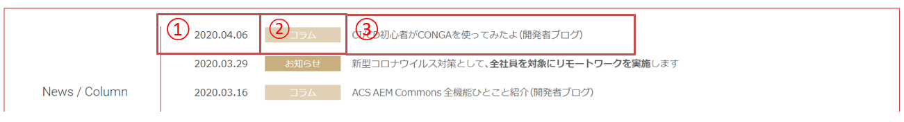
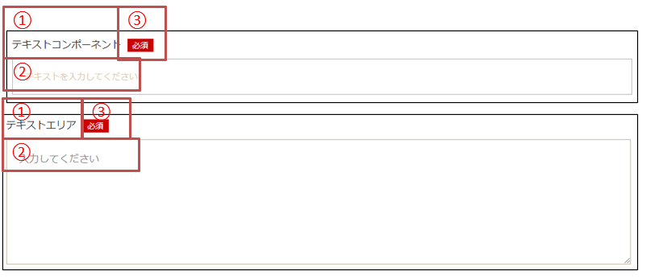
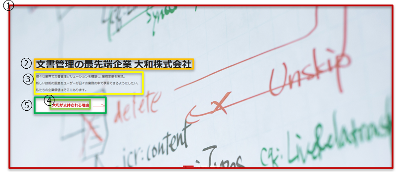
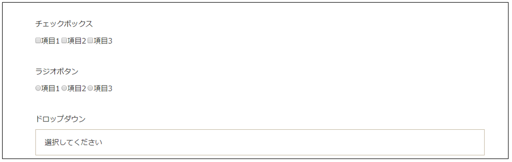
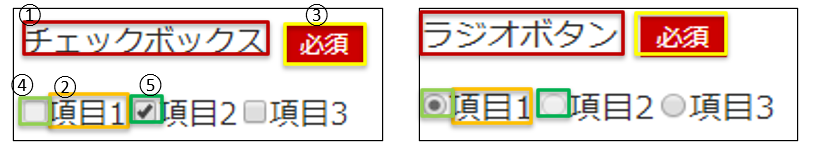
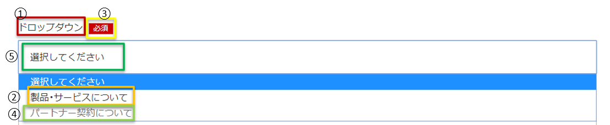
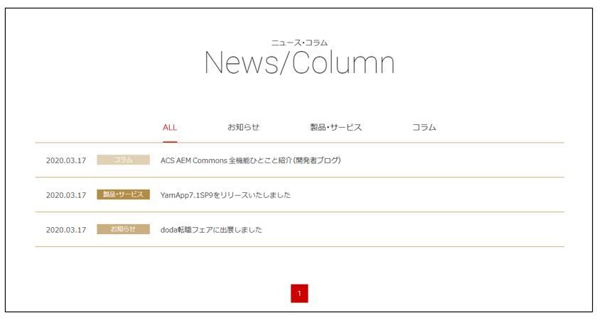
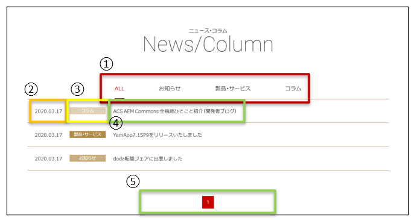

## 実習デモ
デモとして作成するコンポーネントは以下の2つです

- 最新ニュースコンポーネント
  - 最新のニュース3件だけをトップに表示するためのコンポーネント
- フォームテキストコンポーネント
  - 問い合わせフォーム内のテキスト入力部分を作成するためのコンポーネント

### 実習デモ - 最新ニュースコンポーネント
#### 画面概要


#### 項目定義
| #    | 内容       | 詳細内容                   | 動作                                 |
| :--- | :--------- | :------------------------- | :----------------------------------- |
| ①    | 最終編集日 | yyyy.MM.ddで表示           | -                                    |
| ②    | カテゴリ   | 記事のカテゴリ             | -                                    |
| ③    | タイトル   | 各ニュースページのタイトル | クリックすると各ニュースページへ遷移 |

#### 仕様

- ダイアログで設定したルートパス配下のページに存在するニュースを最新3件取得して表示する
- 並び順はページの最終編集時間
  - 日付の形式はyyyy.MM.dd
  - HTLで表示する項目は
    - ニュース記事の日付(ページの最終編集日)
    - ニュース記事のカテゴリ
      - ページに表示される文字列(製品・サービス、コラム、お知らせ)
      - 内部的にCSSクラスに設定する文字列(products, columns, info)
    - ニュース記事のURL
    - ニュース記事のタイトル(ページのタイトル)

#### 実際のHTMLの一例

```html
<div data-sly-use.newsList="${ 'com.adobe.aem.guides.yamato.core.models.news.NewsList' }"
    data-sly-use.placeholderTemplate="core/wcm/components/commons/v1/templates.html"
    data-sly-test.hasContent="${ !newsList.empty }">
    <section class="home-section01">
        <div class="home-section01-inner">
            <div class="home-section01-contents">
                <h2 class="home-section01-title">News / Column</h2>
                <div class="home-news-list">
                    <article class="home-news-item" data-sly-repeat.article="${ newsList.articlePages @ begin=0, end=2 }">
                        <span class="home-news-item-link">
                            <time class="home-news-item-time">${ 'yyyy.MM.dd' @ format=article.date }</time>
                            <div class="home-news-item-category">
                                <span class="icon icon-${ article.category }">${ article.categoryDisplayName }</span>
                            </div>
                            <h3 class="home-news-item-title">
                                <a href="${ article.path }.html" rel="noopener noreferrer" target="_blank">
                                    ${ article.title }
                                </a>
                            </h3>
                        </span>
                    </article>
                </div>
                <div class="home-news-more">
                    <a href="${ properties.rootPath }.html">一覧を見る</a>
                </div>
            </div>
        </div>
    </section>
</div>
<sly data-sly-call="${placeholderTemplate.placeholder @ isEmpty=!hasContent}"></sly>
```

***

### 実習デモ - フォームテキストコンポーネント
#### 画面概要


- ダイアログで設定した構成のテキスト入力欄を作成するコンポーネント
- テキストエリアの場合はtextareaタグを使用し、それ以外はinputタグを使用する

#### 項目定義
| #    | 内容             | 詳細内容                               | 動作                           |
| :--- | :--------------- | :------------------------------------- | :----------------------------- |
| ①    | ラベル           | テキスト入力欄のラベル                 | -                              |
| ②    | ヘルプメッセージ | 入力欄が空の時に表示される文字列       | -                              |
| ③    | 必須             | この文言が入っている入力欄は必須となる | 入力欄が空欄のまま送信できない |

#### 仕様
- テキスト入力欄を作成するコンポーネント
- HTLで表示する項目は
  - フォーム欄の近くに表示されるラベル
  - そのテキスト入力欄が必須項目かどうか
  - 入力欄のタイプ
  - デフォルト値
  - 入力欄のプレースホルダー
  - 入力値のname属性

#### 実際のHTMLの一例

```html
<div class="form-row">
    <div class="form-label">${ properties.label }<span data-sly-test="${ properties.required }" data-sly-text="必須" class="required"></span></div>
    <div class="form-field">
        <textarea
            data-sly-test.useTextArea="${ properties.type == 'textarea' }"
            name="${ properties.name }"
            placeholder="${ properties.helpMessage }"
            cols="30"
            rows="10">${ properties.value }</textarea>
        <input
            data-sly-test="${ !useTextArea }"
            type="${ properties.type }"
            name="${ properties.name }"
            size="60"
            value="${ properties.value }"
            placeholder="${ properties.helpMessage }" />
    </div>
</div>
```

***

## 実習
以下の3つのコンポーネントのHTL部分を実習として作成していただきます。

- ヒーロー画像(トップ)
  - トップページ用のヒーロー画像コンポーネント
- フォームオプションコンポーネント
  - 問い合わせフォーム内の選択形式の入力部分を作成するためのコンポーネント
- ニュースリストコンポーネント
  - ニュース記事ページ一覧を表示するコンポーネント

### 実習の手順
1. 各コンポーネントに置かれている{コンポーネント名}.html という名前のファイルをCRXDEで開く
2. 手順1で開いたhtmlファイルは不完全な状態になっているので、HTL部分を自分で埋める
3. 予め用意されたそのコンポーネントが配置されたページを開き、表示を確認する
4. 確認して表示に問題が無ければ終了、そうでなければ自分で埋めたHTL部分を編集する

## 実習 - ヒーロー画像(トップ)
### ヒーロー画像とは
トップページを開いたときに表示されている画像


### コンポーネント、確認用ページの場所

| 内容 | 場所 |
|:-|:-|
|コンポーネント|/apps/yamato/components/content/heroimage|
|確認用ページ|/content/yamato/jp/ja/hero-image-tutorial|

### 実装する箇所


|#|内容|意味、動作|HTL側での呼び出し方|
|:-|:-|:-|:-|
|①|画像パス|ヒーロー画像として表示される画像|src|
|②|タイトル|画像上に表示したいリンクを説明するタイトル|contentsTitle|
|③|キャプション|タイトルに補足する説明|contentsText|
|④|ボタンラベル|リンク先の紹介|buttonLabel|
|⑤|リンク先URL|ボタンのリンク先URL|url|
|⑥| 表示条件 |ヒーロー画像が空かどうか|empty|

### 要件
- ヒーロー画像が入力されていない空の場合、div.home-hero配下は表示しない
- キャプション、テキストに関してはHTMLタグを含んだ表示を可とする

### 出力したいHTML

```html
<div class="home-hero">
  <div class="home-hero-list" id="js-home-hero-slider">
    <div class="home-hero-item" style="background-image:url(https://www.yamato-ltd.com/wp/wp-content/themes/yamato/src/images/home/img_slide_small_01.jpg);">
      
      <div class="home-hero-item-contents js-first-item-contents">
        <div class="home-hero-item-contents-inner">
          <p class="home-hero-item-contents-title">
            文書管理の最先端企業<br>
            大和株式会社
          </p>
          <div class="home-hero-item-contents-text">
            <p>
              様々な業界で文書管理ソリューションを構築し、業務変革を実現。<br>
              新しい技術の恩恵をユーザーが日々の業務の中で享受できるようにしたい、<br>
              私たちの企業価値はそこにあります。
            </p>
          </div>
          <div class="home-hero-item-contents-more">
            <a href="https://www.yamato-ltd.com/advantage/" class="button button-icon button-right-arrow">大和が支持される理由</a>
          </div>
        </div>
      </div>
    </div>
    <div class="home-hero-item" style="background-image:url(https://www.yamato-ltd.com/wp/wp-content/themes/yamato/src/images/home/img_slide_small_02.jpg);">
      
      <div class="home-hero-item-contents">
        <div class="home-hero-item-contents-inner">
          <p class="home-hero-item-contents-title">
            企業が必要とする<br>
            ソリューションを提供
          </p>
          <div class="home-hero-item-contents-text">
            <p>
              企業として対応不可欠な法令順守、管理されていないファイルを扱うことによる損失、<br>
              ISMSに対応した情報セキュリティなど、企業が必要とするソリューションの実現を支援します。
            </p>
          </div>
          <div class="home-hero-item-contents-more">
            <a href="https://www.yamato-ltd.com/solution/" class="button button-icon button-right-arrow">ソリューション・事例</a>
          </div>
        </div>
      </div>
    </div>
    <div class="home-hero-item" style="background-image:url(https://www.yamato-ltd.com/wp/wp-content/themes/yamato/src/images/home/img_slide_small_03.jpg);">
      
      <div class="home-hero-item-contents">
        <div class="home-hero-item-contents-inner">
          <p class="home-hero-item-contents-title">
            目指すは、<br>
            仕事に感動を与える会社
          </p>
          <div class="home-hero-item-contents-text">
            <p>
              一つ一つのお客様、プロジェクトで感動を与えることを目指し、<br>
              より多くの方々とビジネスを行い、関わる全ての人に感動を与える、それが我々のビジョンです。
            </p>
          </div>
          <div class="home-hero-item-contents-more">
            <a href="https://www.yamato-ltd.com/company/philosophy/" class="button button-icon button-right-arrow">大和 理念と想い</a>
          </div>
        </div>
      </div>
    </div>
  </div>
</div>
```

***

## 実習 - フォームオプションコンポーネント
### フォームオプションとは
- 問い合わせ画面で選択可能な入力欄
- チェックボックス、ラジオボタン、ドロップダウンから選択可能
- ダイアログで選択肢が1つも作成されていない場合はコンポーネントを表示しない


### コンポーネント、確認用ページの場所

| 内容 | 場所 |
|:-|:-|
|コンポーネント|/apps/yamato/components/form/options|
|確認用ページ|/content/yamato/jp/ja/contact|

### 実装する箇所



Javaクラス: com.adobe.aem.guides.yamato.core.models.form.Option

|#|内容|意味|HTL側での呼び出し方|
|:-|:-|:-|:-|
|①|ラベル|この入力欄につけるラベル|label|
|②|項目表示名|選択項目の名前|text|
|③|必須マーク|このマークがある入力欄は必須|required|
|④|無効(disalbed)属性|この項目の選択は不可|disabled|
|⑤|選択済み(checked)属性|この項目はページを開いたときからチェック済み|selected|
|⑥|送信時の名前(name属性)|送信するときの名前|name|
|⑦|送信時の値(value属性)|送信するときの値|value|
|⑧|表示条件|ダイアログで作成した選択肢が空かどうか|empty|

### 詳細
#### 出力したいHTML

- ドロップダウン

```html
<div class="form-row">
    <div class="form-label">お問い合わせ種別<span class="required">必須</span></div>
    <div class="form-field">
        <div class="select-wrapper"><select name="お問い合わせ種別" class="select-type">
                <option value="" selected='selected'>
                    選択してください </option>
                <option value="製品・ソリューションについて">
                    製品・ソリューションについて </option>
                <option value="パートナー契約について">
                    パートナー契約について </option>
                <option value="採用・インターンシップについて">
                    採用・インターンシップについて </option>
                <option value="取材・講演依頼">
                    取材・講演依頼 </option>
                <option value="大和株主・IRについて">
                    大和株主・IRについて </option>
            </select>
        </div>
    </div>
</div>
```

- チェックボックス

```html
<div class="form-row">
  <div class="form-label">チェックボックス<span class="required">必須</span></div>
  <div class="form-field">
    <div class="select-wrapper">
      <label>
          <input type="checkbox" name="name" disabled value="value1"/>項目1
      </label>
      <label>
          <input type="checkbox" name="name" checked value="value2"/>項目2
      </label>
      <label>
          <input type="checkbox" name="name" value="value3"/>項目3
      </label>
    </div>
  </div>
</div>
```

- ラジオボタン

```html
<div class="form-row">
  <div class="form-label">ラジオボタン<span class="required">必須</span></div>
  <div class="form-field">
    <div class="select-wrapper">
      <label>
          <input type="radio" name="radio" checked value="value1"/>項目1
      </label>
      <label>
        <input type="radio" name="radio" disabled value="value2"/>項目2
      </label>
      <label>
          <input type="radio" name="radio" value="value3"/>項目3
      </label>
    </div>
  </div>
</div>
```

***

## 実習 - ニュースリストコンポーネント
### ニュースリストとは
- ダイアログで入力したルートパス配下のニュースページを全て取得してリスト表示するコンポーネント
- 1ページに表示する件数は10件


### コンポーネント、確認用ページの場所

| 内容 | 場所 |
|:-|:-|
|コンポーネント|/apps/yamato/components/structure/newslist|
|確認用ページ|/content/yamato/jp/ja/news|

### 実装する箇所


- Javaクラス
  - ニュースリスト本体: com.adobe.aem.guides.yamato.core.models.news.NewsList

#### 全体のHTML

```html
<section class="news-section01">
    <div class="inner">
        <div class="news-section01-nav">
            <ul>
                <li><span class="is-current">ALL</span></li>
                <li><a href="https://www.yamato-ltd.com/news/category/info/">お知らせ</a></li>
                <li><a href="https://www.yamato-ltd.com/news/category/products/">製品・サービス</a></li>
                <li><a href="https://www.yamato-ltd.com/news/category/columns">コラム</a></li>
            </ul>
        </div>

        <div class="news-section01-list">
            <article class="news-section01-item">
                <span class="link"><time class="date">2020.02.03</time>
                    <div class="category"><span class="category-icon category-icon-info">お知らせ</span></div>
                    <div class="title"><a href="https://www.wantedly.com/companies/yamato-ltd/post_articles/182289"
                            target="_blank" rel="noopener noreferrer">大和株式会社は、柔軟な勤務形態で社員の働きやすさをサポートしています</a>（Wantedly掲載）
                    </div>
                </span>
            </article>
            <article class="news-section01-item">
                <a href="https://www.yamato-ltd.com/news/20200131-1502/" class="link"><time
                        class="date">2020.01.31</time>
                    <div class="category"><span class="category-icon category-icon-products">製品・サービス</span></div>
                    <div class="title">第1回 CARA ハンズオン会のご報告<span class="news-icon"></span></div>
                </a>
            </article>
            <article class="news-section01-item">
                <a href="https://www.yamato-ltd.com/news/20200130-1500/" class="link"><time
                        class="date">2020.01.30</time>
                    <div class="category"><span class="category-icon category-icon-info">お知らせ</span></div>
                    <div class="title">TECH::EXPERTで事業説明を実施しました<span class="news-icon"></span></div>
                </a>
            </article>
            <article class="news-section01-item">
                <span class="link"><time class="date">2020.01.08</time>
                    <div class="category"><span class="category-icon category-icon-products">製品・サービス</span></div>
                    <div class="title"><a
                            href="/wcm/adobe-training/">アドビ製品の公式トレーニングを特別価格で受講できる<strong>アドビ公式トレーニング申し込みサービス</strong>を始めました</a>
                    </div>
                </span>
            </article>
            <article class="news-section01-item">
                <a href="https://www.yamato-ltd.com/news/20200101-721/" class="link"><time
                        class="date">2020.01.01</time>
                    <div class="category"><span class="category-icon category-icon-info">お知らせ</span></div>
                    <div class="title">2020年　年頭のご挨拶<span class="news-icon"></span></div>
                </a>
            </article>
            <article class="news-section01-item">
                <span class="link"><time class="date">2019.10.31</time>
                    <div class="category"><span class="category-icon category-icon-info">お知らせ</span></div>
                    <div class="title"><a href="https://www.wantedly.com/companies/company_6565238/post_articles/192976"
                            target="_blank">WantedlyにAdobe社とのコラボ記事が掲載されました</a></div>
                </span>
            </article>
            <article class="news-section01-item">
                <span class="link"><time class="date">2019.10.24</time>
                    <div class="category"><span class="category-icon category-icon-info">お知らせ</span></div>
                    <div class="title"><a href="https://www.wantedly.com/projects/361887"
                            target="_blank">Wantedlyにコンサルタントの募集を掲載しました</a></div>
                </span>
            </article>
            <article class="news-section01-item">
                <a href="https://www.yamato-ltd.com/news/20190813-677/" class="link"><time
                        class="date">2019.08.13</time>
                    <div class="category"><span class="category-icon category-icon-info">お知らせ</span></div>
                    <div class="title">8/10(土) doda転職フェアに出展しました<span class="news-icon"></span></div>
                </a>
            </article>
            <article class="news-section01-item">
                <a href="https://www.yamato-ltd.com/news/20190625-671/" class="link"><time
                        class="date">2019.06.25</time>
                    <div class="category"><span class="category-icon category-icon-info">お知らせ</span></div>
                    <div class="title">Generis社とのパートナー契約を締結<span class="news-icon"></span></div>
                </a>
            </article>
            <article class="news-section01-item">
                <span class="link"><time class="date">2019.06.15</time>
                    <div class="category"><span class="category-icon category-icon-info">お知らせ</span></div>
                    <div class="title"><a href="/wcm/">WCMサービスに関するページをオープンしました</a></div>
                </span>
            </article>
        </div>
    </div>
    <div class='wp-pagenavi' role='navigation'>
        <span aria-current='page' class='current'>1</span>
        <a class="page larger" title="Page 2" href="https://www.yamato-ltd.com/news/page/2/">2</a>
        <a class="page larger" title="Page 3" href="https://www.yamato-ltd.com/news/page/3/">3</a>
        <a class="page larger" title="Page 4" href="https://www.yamato-ltd.com/news/page/4/">4</a>
        <a class="page larger" title="Page 5" href="https://www.yamato-ltd.com/news/page/5/">5</a>
        <a class="nextpostslink" rel="next" href="https://www.yamato-ltd.com/news/page/2/">NEXT</a>
    </div>
</section>
```

#### カテゴリタブ
- Javaクラス: com.adobe.aem.guides.yamato.core.models.news.NewsCategoryTab

- 各カテゴリへのリンク
- タブのように表示しているが、実際は各カテゴリページへのリンク
- 現在表示しているカテゴリはaタグではなくspanタグとなり、 `is-current` クラスが付与される

```html
<ul>
    <li><span class="is-current">ALL</span></li>
    <li><a href="https://www.yamato-ltd.com/news/category/info/">お知らせ</a></li>
    <li><a href="https://www.yamato-ltd.com/news/category/products/">製品・サービス</a></li>
    <li><a href="https://www.yamato-ltd.com/news/category/column/">コラム</a></li>
</ul>
```

|#|内容|意味|HTLでの呼び出し方|
|:-|:-|:-|:-|
|①|liタグの子となるHTMLタグ|現在表示しているカテゴリと一致する場合spanタグ、そうでない場合はaタグ|allTag|
|  |  |  |infoTag|
|  |  |  |productsTag|
|  |  |  |columnsTag|
|②|liタグの子要素の属性|属性の名前をkey、値をvalueとしたMap|allAttr|
|  |  |  |infoAttr|
|  |  |  |productsAttr|
|  |  |  |columnsAttr|

#### 記事一覧
- 記事一覧をarticleタグ内に出力する

```html
<div class="news-section01-list">
    <article class="news-section01-item">
        <span class="link"><time class="date">2020.05.26</time>
            <div class="category">
                <span class="category-icon category-icon-columns">コラム</span>
            </div>
            <div class="title">
                <a href="https://www.yamato-ltd.com/news/20200523-1748/" target="_blank" rel="noopener noreferrer">Gmailアカウントを利用してワークフローの完了を通知する（開発者ブログ）</a>
            </div>
        </span>
    </article>
    <article class="news-section01-item">
        <span class="link"><time class="date">2020.05.23</time>
            <div class="category">
                <span class="category-icon category-icon-info">お知らせ</span>
            </div>
            <div class="title">
                <a href="https://www.yamato-ltd.com/news/20200523-1748/" target="_blank" rel="noopener noreferrer">リモートワークによる業務体制を7/31まで延長します</a>
            </div>
        </span>
    </article>
</div>
```

|#|内容|意味|HTLでの呼び出し方|
|:-|:-|:-|:-|
|①|日付フォーマット|記事の日付の表示形式|yyyy.MM.dd|
|②|記事日付|記事の日付(cq:lastModifiedプロパティ)|date|
|③|記事のカテゴリ(内部)|CSSクラスに用いるためのカテゴリ|category|
|④|記事のカテゴリ(外部)|表示に使うためのカテゴリ|categoryDisplayName|
|⑤|記事のパス|該当の記事ページのリンク先|path|
|⑥|タイトル|記事のタイトル(jcr:titleプロパティ)|title|

#### ページャ
- Javaクラス: com.adobe.aem.guides.yamato.core.models.news.pager.Pager
  - HTLでの呼び出し時に `articlesSize=newsList.articlePages.size` を引数で渡す

- 合計ページ数の計算や、現在ページ数の判定などは全てJava側で行われるので、HTL側では以下の3点のみについて考慮すればよい
  - PREVボタン
  - ページャリンク
  - NEXTボタン
- また、上記の3つを表すオブジェクトはPagerクラスから取得が可能
- 現在のページが1ページ目の場合、PREVボタンは表示しない
- 現在のページが最終ページの場合、NEXTボタンは表示しない
  - PREV,NEXT共に条件の判定をJava側で行っているため、表示するかしないかを保存した変数を使うだけでよい

```html
<div class='wp-pagenavi' role='navigation'>
    <!-- PREVボタン -->
    <a class="previouspostslink" rel="prev" href="https://www.yamato-ltd.com/news/">PREV</a>
    <!-- ページャリンク -->
    <a class="page larger" title="Page 1" href="https://www.yamato-ltd.com/news/">1</a>
    <span aria-current="page" class="current">2</span>
    <a class="page larger" title="Page 3" href="https://www.yamato-ltd.com/news/page/3/">3</a>
    <a class="page larger" title="Page 4" href="https://www.yamato-ltd.com/news/page/4/">4</a>
    <a class="page larger" title="Page 5" href="https://www.yamato-ltd.com/news/page/5/">5</a>
    <!-- NEXTボタン -->
    <a class="nextpostslink" rel="next" href="https://www.yamato-ltd.com/news/page/2/">NEXT</a>
</div>
```

##### PREVボタン
|#|内容|意味|HTLでの呼び出し方|
|:-|:-|:-|:-|
|①| PREVボタンそのもの ||preview|
|②| PREVボタンを表示するかしないか ||preview.exists|
|③|前ページへのリンク先|前ページへ遷移するためののパス|preview.path|

##### ページャリンク
|#|内容|意味|HTLでの呼び出し方|
|:-|:-|:-|:-|
|①| ページャリンクのリスト |各ページャオブジェクトを格納したリスト|pagerLinks|
|②| 現在位置のページ番号に付与されるクラス ||currentClass|
|③| タグ | 現在位置にはリンク先を設定しないのでspanタグ、それ以外はaタグとする | tag |
|④| その他の属性 | 属性の名前をkey、値をvalueとしたMap | attribute|

##### NEXTボタン
|#|内容|意味|HTLでの呼び出し方|
|:-|:-|:-|:-|
|①| NEXTボタンそのもの ||next|
|②| NEXTボタンを表示するかしないか ||next.exists|
|③|次ページへのリンク先|前ページへ遷移するためのパス|next.path|

